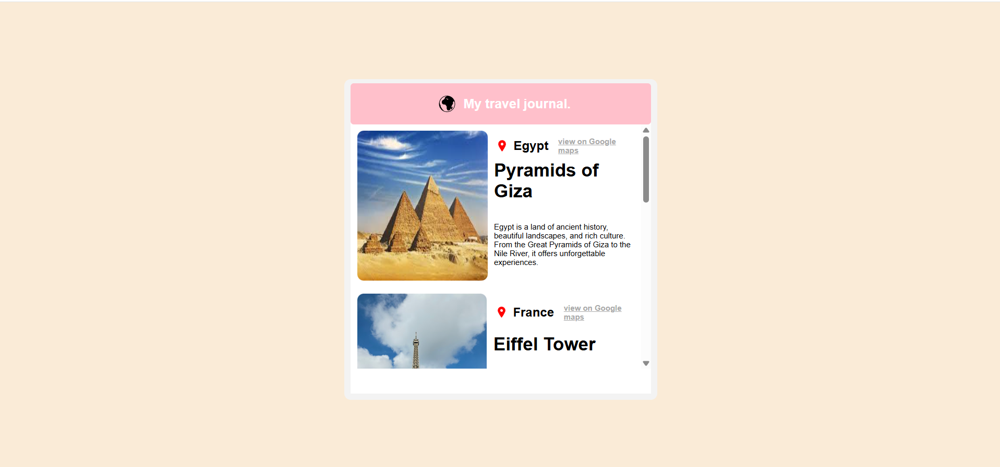

# Travel Journal Website Description.
It's a simple travel journal static website. It consists of One main section, which contains cards components, Each component of them contains some informations about the location and the time of visit and another simple informations.

## What I Learned
- How to use props to pass data between components  
- How React one-way data flow works  
- How to structure a project using reusable components  

## Built With
- React  
- CSS  
- JavaScript

## Features
- Static travel journal layout  
- Dynamic rendering using props  
- Clean component-based structure  

## Purpose
The goal of this project was to strengthen my understanding of React fundamentals, especially props and component communication.
  